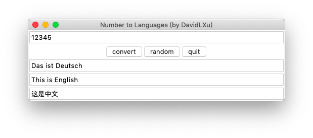
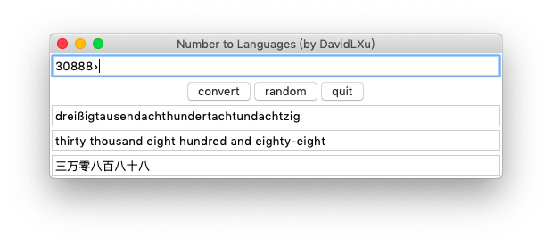
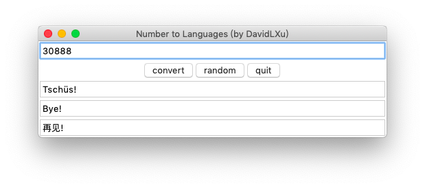

# num2language
Convert numbers to natural languages.

Currently available: Chinese, German, English.

## Supported maximun value

**Deutsch**: 0~99999999999999. Die maximale Zahl ist

neunundneunzigbillionneunhundertneunundneunzigmilliardeneunhundertneunundneunzigmillionneunhundertneunundneunzigtausendneunhundertneunundneunzig.

**English**: 0~99999999999999999999. The largest number is

ninety-nine quintillion nine hundred and ninety-nine quadrillion nine hundred and ninety-nine trillion nine hundred and ninety-nine billion nine hundred and ninety-nine million nine hundred and ninety-nine thousand nine hundred and ninety-nine 

**中文**: 0~Infinity. 支持任意大的数字（中国现代计数系统）

## Program Interface

## 附 中文计数系统
中国古代有万亿为兆，万兆为京的说法；也有亿亿为兆的说法；

建国后，兆改为百万，不再有比亿大的单位，大数字就是亿的累加

中国现代计数方法，四个一小组，八个一大组，大组以亿的幂次为计

亿^0

个		十		百		千

万		十万		百万		千万

亿^1

亿		十亿		百亿		千亿

万亿		十万亿	百万亿	千万亿

亿^2

亿亿		十亿亿	百亿亿	千亿亿

万亿亿	十万亿亿	百万亿亿	千万亿亿

给编程的启示：每完成八次十进，字符串末尾添加‘亿’
